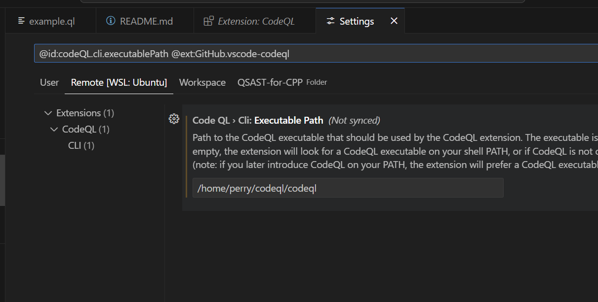
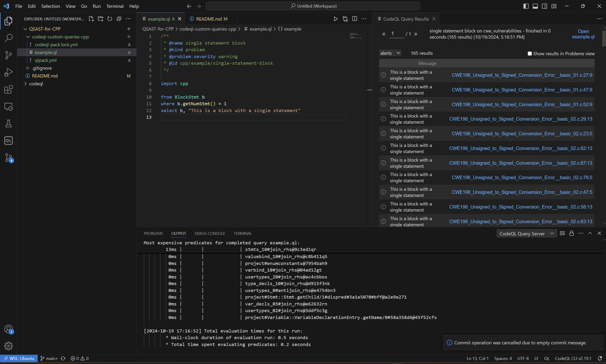

# QSAST for CPP

Running codeQL against CWE.

## todos

- ~~setup the vscode-starter workspace~~
- ~~create the codeQL database for the code under test~~
  - ~~still need the codeQL cli~~
  - ~~ref <https://docs.github.com/en/code-security/codeql-cli/getting-started-with-the-codeql-cli/preparing-your-code-for-codeql-analysis>~~

## objective

- use Q-SAST tools, in particular CodeQL, to detect vulnerabilities in programs.
  - improve the official query database for C/C++: <https://codeql.github.com/docs/codeql-language-guides/basic-query-for-cpp-code/>
  - If CodeQL identifies non-vulnerable code pieces as vulnerable with a query rule, improve the query to avoid the false alarm.
  - If CodeQL fails to identify a known vulnerability, please write a new query for it.
- to evaluate, we select five CWE cases from <https://github.com/arichardson/juliet-test-suite-c>

## build commands

- building codeql db for cwe 196 and 122
  - codeql database create ~/cybersecurity2024/cwe_vulnerabilities --language=c-cpp --overwrite --command "python3 juliet.py 196 122 -g -m -r -k"

## tutorial

### installing codeQL

these steps were tested on Linux only

- reference: <https://github.com/github/vscode-codeql-starter/>
  - inside wsl
    - download the codeQL cli from <https://github.com/github/codeql-cli-binaries/releases/tag/v2.19.1>
      - unzip it and add <extraction-root>/codeql/codeql to the **PATH** variable
        - vim ~/.bashrc
        - append **export PATH="$PATH:/home/perry/codeql"**
    - clone <https://github.com/github/vscode-codeql-starter/> recursively

      ```bash
      git clone --recursive https://github.com/github/vscode-codeql-starter/
      ```

    - install codeQL vscode extension
      - If you have downloaded the codeql cli.
        - copy the path /home/perry/codeql/codeql to the extension's codeql cli path
          - 
      - Otherwise, the extension will download a verions of the codeql cli for you
        - the extension-managed CodeQL CLI is not accessible from the terminal. If you intend to use the CLI outside of the extension (for example to create databases), we recommend that you install your own copy of the CodeQL CLI.

#### Setting up a custom CodeQL workspace(optional)

do this if you don't want to work inside the vscode starter workspace(possibly for version control)

- clone <https://github.com/github/codeql.git> any where
- setup a seperate workspace for your project, and open it with vscode
- add the cloned codeql repo folder to the current workspace

### creating your own codeQL database for analysis

here we target a repo including cwe_vulnerabilitiess

- install cmake if it is not present
  
  ```bash
  sudo apt-get install build-essential libssl-dev
  cd /tmp
  wget https://github.com/Kitware/CMake/releases/download/v3.20.0/cmake-3.20.0.tar.gz
  cd cmake-3.20.0
  ./bootstrap
  make
  sudo make install
  cmake --version
  ```

- check out <https://github.com/arichardson/juliet-test-suite-c.git>
  - we have heard that in some cases, one must edit **juliet-run.sh** as the way it is in this commit <https://github.com/arichardson/juliet-test-suite-c/commit/f4fe457c1c42f7d06bbcadf9deb0b0b6ae15b4de> in order to build successfully.
  - inside the repo, do the following

    ```ps
    python3 juliet.py 196 -g -m -r -k # to make sure that you can build one of the vulnerabilities
    codeql database create ~/cybersecurity2024/cwe_vulnerabilities --language=c-cpp --overwrite --command "python3 juliet.py 196 -g -m -r -k" # this should build the codeql database for CWE-196: Unsigned to Signed Conversion Error
    ```

  - if you see something like the following, then the database is created successfully

    ```txt
    Successfully created database at /home/perry/cybersecurity2024/cwe_vulnerabilities.
    ```

### running your first query against the customized database

- specify the path to the database in the codeQL extension
  - select **choose database from folder** in the LHS panel
- paste the following code into **codeql-custom-queries-cpp/example.ql**, this should always return something

  ```codeql
    /**
   * @name single statement block
   * @kind problem
   * @problem.severity warning
   * @id cpp/example/single-statement-block
   */

  import cpp
  
  from BlockStmt b
  where b.getNumStmt() = 1
  select b, "This is a block with a single statement"

  ```

  you should see something like this as a reult  
  
